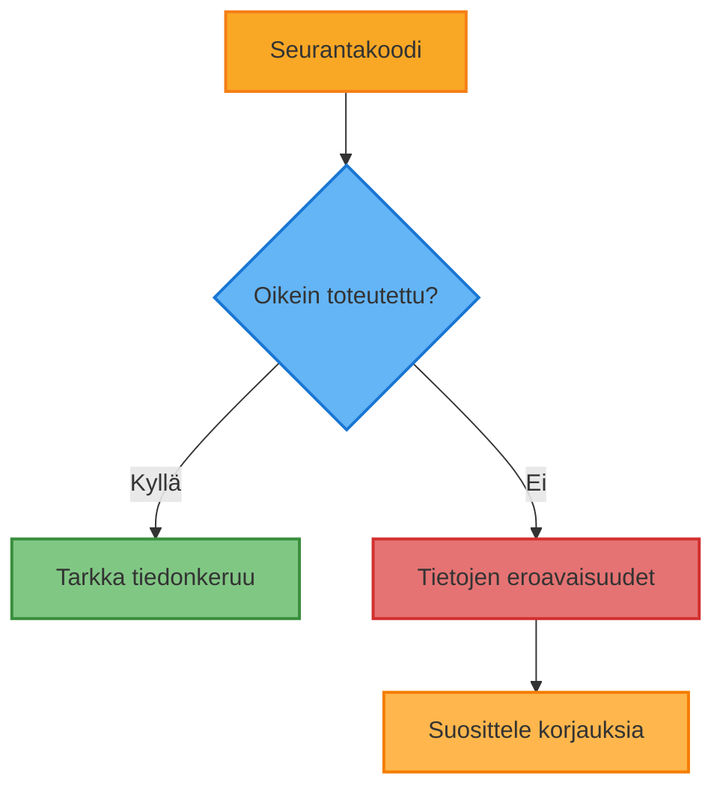

# Matomo-tilin auditointi
## Riihimäen kaupunki

Verkkoanalytiikkastrategian kehittäminen

  
    Aloita esitys <carbon:arrow-right class="inline"/>
  

  <a href="https://matomo.org" target="_blank" alt="Matomo Website"
    class="text-xl icon-btn opacity-50 !border-none !hover:text-white">
    <carbon:logo-github />
  </a>

  

    Esittäjä: Juuso Jaakkola 
    Päivämäärä: 17.10.2024
  

---
layout: two-cols
---

<!-- {id: esityslista} -->

# Esityslista

1. Johdanto Matomoon
2. Auditoinnin tavoitteet
3. Keskeiset painopistealueet
4. Menetelmät
5. Havainnot ja suositukset
6. Seuraavat vaiheet

::right::

  

    Analytiikka
  

---
layout: image-right
image: 'https://source.unsplash.com/random/800x600'
---

# Johdanto Matomoon

<v-clicks>

- 🔓 Avoimen lähdekoodin verkkoanalytiikka-alusta
- 🛡️ Yksityisyyteen keskittyvä vaihtoehto Google Analyticsille
- 🖥️ Itse ylläpidetty tai pilvipalveluna tarjottu
- 🔧 Muokattava ja laajennettava

</v-clicks>

---

# Auditoinnin tavoitteet

  

    <carbon-document-add class="text-3xl mb-2" />
    
Arvioida nykyinen Matomo-toteutus

  

  

    <carbon-search class="text-3xl mb-2" />
    
Tunnistaa puutteet seurannassa ja raportoinnissa

  

  

    <carbon-chart-average class="text-3xl mb-2" />
    
Arvioida tietojen tarkkuus ja luotettavuus

  

  

    <carbon-security class="text-3xl mb-2" />
    
Varmistaa yksityisyydensuojasäännösten noudattaminen

  

---

# Keskeiset painopistealueet

  

    <h3 class="text-orange-500"><carbon-settings class="inline-block" /> Seurannan asetukset</h3>
  

  

    <h3 class="text-green-500"><carbon-chart-line class="inline-block" /> Tavoitteiden määrittely</h3>
  

  

    <h3 class="text-blue-500"><carbon-shopping-cart class="inline-block" /> Verkkokaupan seuranta</h3>
  

  

    <h3 class="text-purple-500"><carbon-cube class="inline-block" /> Mukautetut ulottuvuudet</h3>
  

  

    <h3 class="text-red-500"><carbon-user-profile class="inline-block" /> Segmentointi</h3>
  

  

    <h3 class="text-yellow-500"><carbon-report class="inline-block" /> Raporttien käyttö</h3>
  

---

# Menetelmät

<v-clicks>

1. 🔍 Tilin tarkastelu ja asetusten analysointi
2. 🧪 Seurantakoodin tarkastus
3. 📊 Tietojen laadun arviointi
4. 👥 Käyttäjähaastattelut
5. 🏆 Vertailu parhaisiin käytäntöihin
6. ⚡ Suorituskykytestaus

</v-clicks>

---

# Havainnot: Seurannan asetukset

  

---

# Havainnot: Tavoitteiden määrittely

## Nykytila
<v-clicks>

- 🎯 X tavoitetta määritelty
- 🌪️ Y konversiosuppiloa asetettu
- 📝 Z tapahtumaa seurataan

</v-clicks>

## Suositukset
<v-clicks>

- ➕ Lisää tavoitteita keskeisille käyttäjätoiminnoille
- 🔍 Tarkenna konversiosuppiloita
- 🔄 Toteuta tapahtumaseuranta vuorovaikutuksille

</v-clicks>

---
layout: image-right
image: '#2a2a2a'
---

# Suositukset

<v-clicks>

1. 🔄 Päivitä seurantakoodi kaikilla sivuilla
2. 🛒 Toteuta laajennettu verkkokaupan seuranta
3. 🧩 Aseta mukautetut ulottuvuudet käyttäjäominaisuuksille
4. 🎯 Luo segmenttejä kohdennettua analyysia varten
5. 📅 Määritä säännölliset automaattiset raportit
6. 🎓 Järjestä henkilöstölle koulutusta Matomon käytöstä

</v-clicks>

---

# Seuraavat vaiheet

  

    <carbon-task class="text-3xl mb-2" />
    
Priorisoi suositukset

  

  

    <carbon-calendar class="text-3xl mb-2" />
    
Luo toteutusaikataulu

  

  

    <carbon-user-multiple class="text-3xl mb-2" />
    
Jaa vastuut

  

  

    <carbon-time class="text-3xl mb-2" />
    
Aikatauluta seuranta-auditointi

  

  

    <carbon-loop class="text-3xl mb-2" />
    
Luo jatkuva seurantaprosessi

  

---
layout: center
class: text-center
---

# Kiitos

Kysymyksiä? Keskustellaan!

  

    Kiitos!
  

---

# Ohjeita käyttäjälle

  
    Siirry diaan "Käyttäjien hallinta Matomossa" <carbon:arrow-right class="inline"/>
  
  
    Siirry diaan "Tagien hallinta Matomossa" <carbon:arrow-right class="inline"/>
  
  /esityslista

---

# Käyttäjien hallinta Matomossa

<v-clicks>

1. Lisää käyttäjä Matomoon:
   - Mene Matomon hallintapaneeliin
   
   - Valitse vasemmalta "Käyttäjät"
   - Klikkaa "Lisää uusi käyttäjä"
   - Syötä käyttäjän sähköpostiosoite ja määritä salasana

</v-clicks>

<v-clicks>

2. Anna käyttöoikeudet tiettyyn sivustoon:
   - Etsi juuri luotu käyttäjä ja klikkaa "Muokkaa"
   - Käyttäjän profiilisivulla näet listan Matomossa olevista sivustoista
   - Valitse sivustokohtaisesti käyttöoikeus:
     - Näytä: Tarkastele raportteja ja dataa
     - Kirjoita: Tarkastele raportteja ja muokkaa asetuksia
     - Admin: Täydet hallintaoikeudet
     - Ei pääsyä: Ei näe mitään dataa

</v-clicks>

---

# Käyttöoikeuksien hallinta

<v-clicks>

- Rajoitettu pääsy tiettyihin osioihin:
  - Käytä Mukautettuja dimensioita, Segmenttejä tai Tavoitteita
  - Rajoita näytettävää dataa käyttäjän oikeuksien perusteella

- Varmistus ja ilmoitukset:
  - Käyttäjä näkee vain sallitut sivustot tai osiot
  - Lähetä ilmoitus sähköpostitse Matomon sisäänrakennetulla toiminnolla

</v-clicks>

---

# Tagien hallinta

<v-clicks>

1. Luo uusi tagi:
   - Mene Matomon hallintapaneeliin
   - Valitse vasemmalta "Tagit"
   - Klikkaa "Lisää uusi tagi"
   - Syötä tagin nimi ja kuvaus

</v-clicks>
---

# Tagien hallinta

<v-clicks>

2. Aseta tagi käyttäjän tai sivuston tagiin:
   - Etsi juuri luotu tagi ja klikkaa "Muokkaa"
   - Valitse sivustokohtaisesti tagin käyttäjä:
     - Näytä: Tarkastele raportteja ja dataa
     - Kirjoita: Tarkastele raportteja ja muokkaa asetuksia
     - Admin: Täydet hallintaoikeudet
     - Ei pääsyä: Ei näe mitään dataa

</v-clicks>

---

# Tagien hallinta

<v-clicks>

3. Luo uusi tagi:
   - Mene Matomon hallintapaneeliin
   - Valitse vasemmalta "Tagit"
   - Klikkaa "Lisää uusi tagi"
   - Syötä tagin nimi ja kuvaus

</v-clicks>
